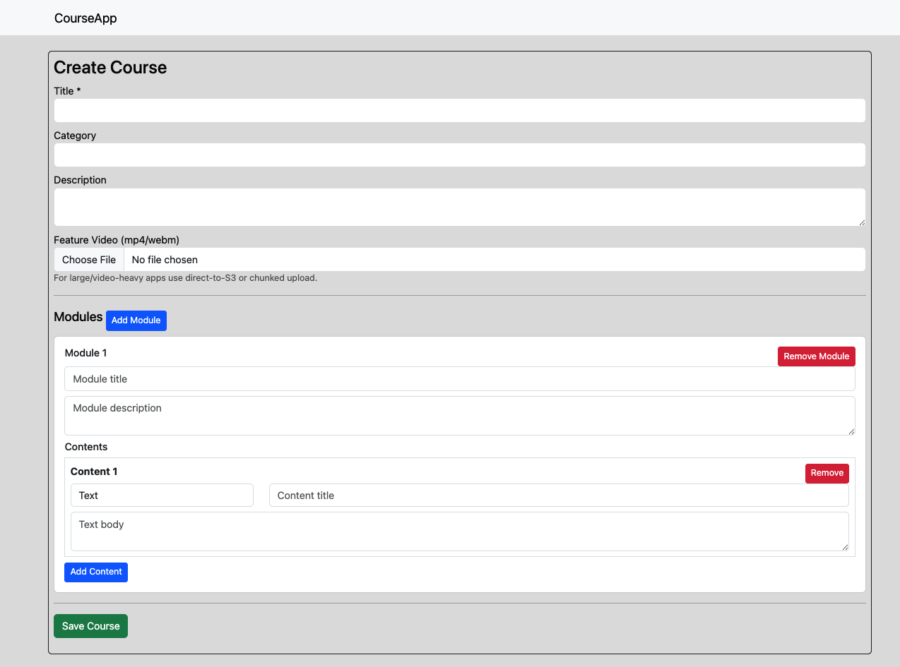
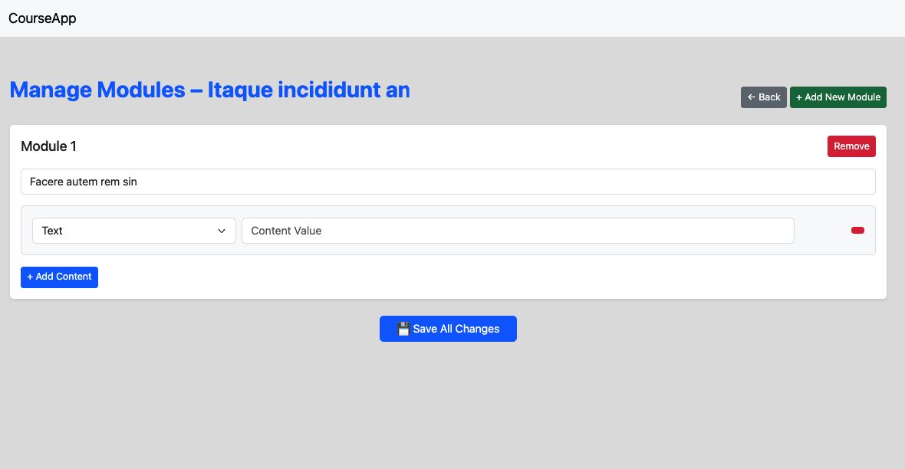
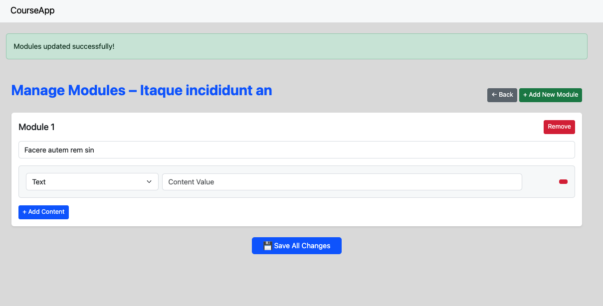
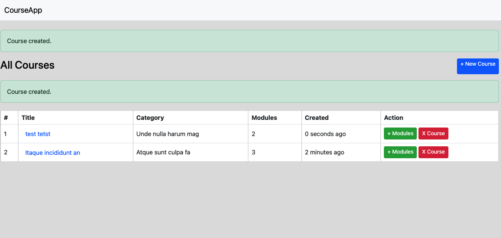

# 📚 Course Builder

---

## Overview

**Course Builder** is a Laravel-based CRUD application to manage courses, modules, and their contents.
It allows:

* Creating multiple courses.
* Adding multiple modules per course.
* Adding multiple contents per module (text, video, image, file, or link).

This is ideal for basic e-learning platforms, content creators, or MVPs for educational apps.

---

## Features

* **Course CRUD** – Create, read, and delete courses.
* **Module Management** – Add multiple modules to a single course.
* **Content Management** – Each module can have multiple content types:

  * Text
  * Image
  * Video
  * File
  * External Link
* **File Uploads** – Feature videos for courses and media for contents.
* **Dynamic Form Builder** – Add modules and contents on-the-fly using a user-friendly interface.

---

## Screenshots

### 1. Course List



### 2. Create Course



### 3. Add Modules & Contents



### 4. View Course




---

## Installation

1. Clone the repo:

```bash
git clone https://github.com/Ahsanjuly29/course-builder.git
cd laravel-course-builder
```

2. Install dependencies:

```bash
composer install
OR 
composer update
npm install
npm run build
```

3. Set up `.env` file and database:

```bash
cp .env.example .env
php artisan key:generate
php artisan migrate
php artisan storage:link
```

4. Run the app:

```bash
php artisan serve
```

---

## Usage

* Go to `/courses` to see all courses.
* Click **Create Course** to add a new course.
* Use the **Add Module** button to add modules dynamically.
* Inside each module, add multiple contents of various types.
* Save and manage your courses, modules, and contents easily.

---

## Tech Stack

* **Backend:** Laravel 10
* **Frontend:** Blade + jQuery
* **Database:** MySQL / SQLite
* **File Storage:** Local (can be switched to S3)

## Folder Structure

```
laravel-course-builder/
├─ app/
├─ bootstrap/
├─ config/
├─ database/
├─ public/
├─ resources/
│  ├─ views/
│  │  ├─ courses/
│  │  ├─ modules/
│  ├─ css/
│  ├─ js/
├─ routes/
├─ storage/
├─ tests/
├─ screenshots/
│  ├─ course-list.png
│  ├─ create-course.png
│  ├─ modules-contents.png
│  ├─ view-course.png
├─ .env.example
├─ README.md
├─ composer.json
├─ package.json
```

* **`screenshots/`** – add actual screenshots from your app here.
* **`resources/views/`** – contains Blade templates for courses and modules.
* **`app/Http/Controllers/`** – CourseController.php and ModuleController.php.

---
 
## License

Open-source & free to use.

```

---